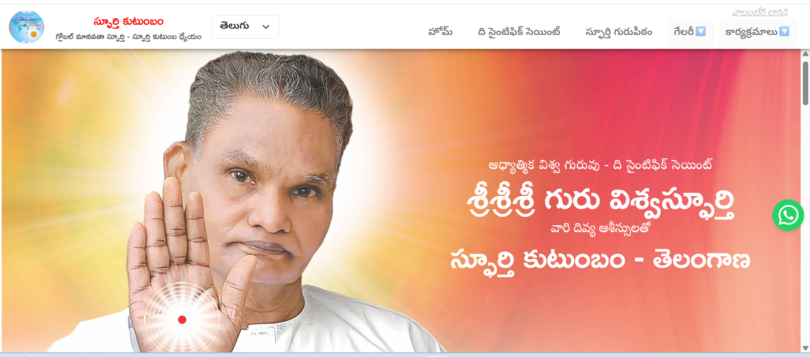
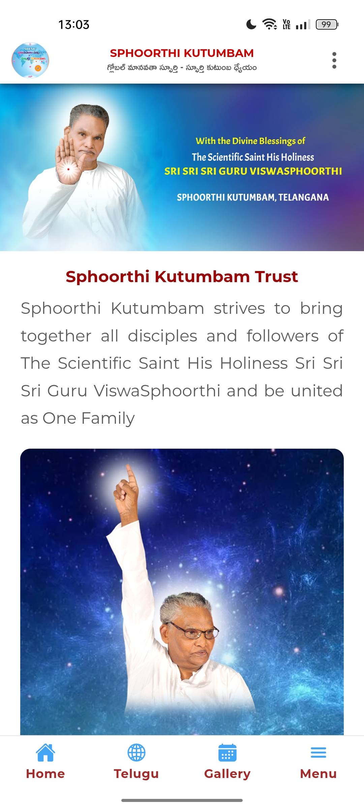
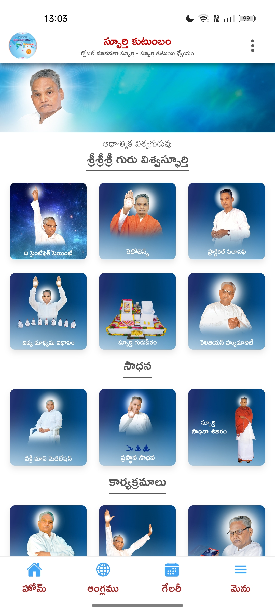
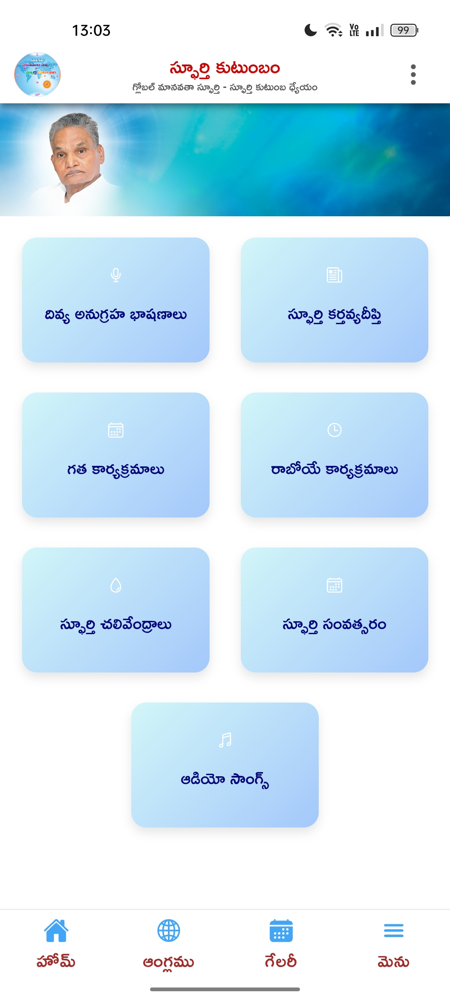

🌐 2️⃣ Bilingual Public Information Website & Mobile App

Frontend — React 18 (CRA) • Ionic (TypeScript) • Capacitor 7
Backend — Django • PostgreSQL

🪶 Overview

A bilingual (Telugu–English) public information platform built for both web and mobile.
Includes dedicated Telugu pages, an easy language switch tab, and an integrated Capacitor 7 Android app for mobile access.
Designed for accessibility, clarity, and smooth performance across devices.

#### 🖼️ Screenshots
|  |  |  |  |

⚙️ Key Features

Bilingual Interface: Seamless toggle between Telugu and English.

Event Management: Dynamic event listings, registration, and photo gallery.

Event Gallery: Automatically displays event images from backend storage.

Event Registration: Interactive forms for public or participant sign-ups.

Mobile App: Packaged and deployed using Capacitor 7 for Android, with native navigation and offline support.

Responsive Layout: React 18 with Ionic for consistent web-to-mobile UX.

Backend Control: Django + PostgreSQL manage events, forms, and content APIs.

🧠 Architecture Overview
Layer	Technology
Frontend	React 18 (CRA) + Ionic (TypeScript)
Mobile	Capacitor 7 (Android Build)
Backend	Django + PostgreSQL
Design	Responsive modular components
Language Handling	Dual-language routing and content rendering

Frontend and backend decoupled via Django REST APIs.

Mobile build shares the same React/Ionic codebase for consistent behavior.

Modular architecture supports quick content updates and scalable deployment.

Event module integrates gallery and registration features for both platforms.

👨‍💻 My Role

Full-stack developer — implemented bilingual UI, backend integration, event registration, and gallery modules; built and packaged the Capacitor 7 Android app.

📊 Outcome

Delivered a modern bilingual platform accessible through web and Android app, enabling users to explore events, register, and view galleries in their chosen language.

🏷️ Tags

React 18 CRA Ionic TypeScript Capacitor 7 Django PostgreSQL
Bilingual Localization Event Registration Responsive Design Mobile App Development Full-Stack